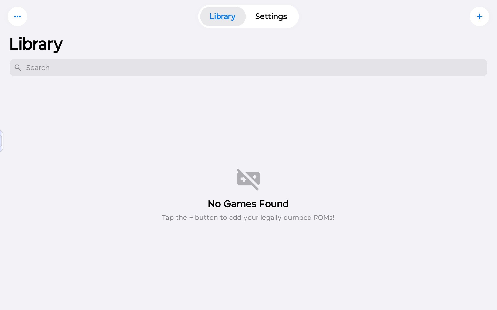
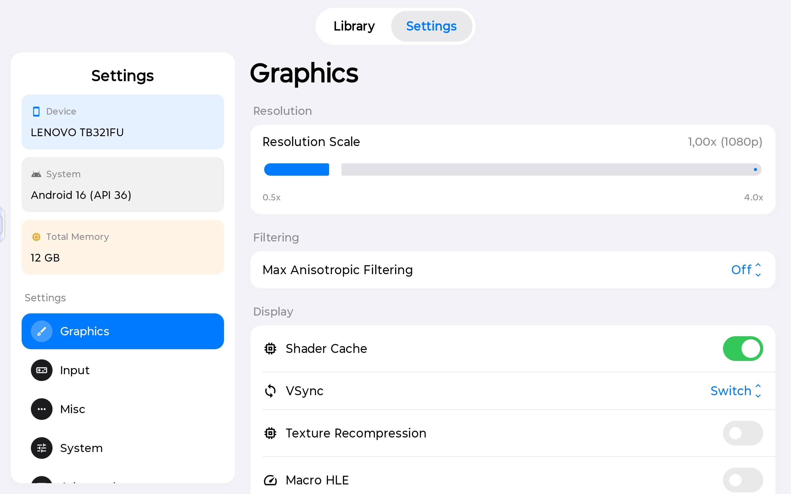

<h1 align="center">
  <b>CrèmeNX</b>
   
  A Nintendo Switch emulator for Android
</h1>

> [!WARNING]
> **CrèmeNX is in a rough, early state.** This is experimental software. Expect crashes, black screens, games that refuse to boot, missing features, and rough edges throughout the UI. It is not a polished, daily-driver emulator, and it is not ready for a general audience yet. If you are looking for something stable, this is not it — at least not yet.

## What this is

CrèmeNX is a fork of [Kenji-NX](https://git.ryujinx.app/projects/Kenji-NX), which itself descends from [Ryubing](https://git.ryujinx.app/projects/Ryubing) and, ultimately, the original Ryujinx emulator created by gdkchan. The emulation core is the same C# codebase those projects are built on; what CrèmeNX changes is mostly the Android front-end wrapped around it.

The menu layout and settings screens are heavily **inspired by [MeloNX](https://github.com/StossyDev/MeloNX)** — the segmented Library/Settings header, the sidebar-driven settings pages, and the general look and feel all take their cues from it.

## Platforms

**Android only, for now.** This is the only platform that is built and tested today.

**iOS support is planned**, but it will be built on a **different core** rather than the one used here — the current core's approach does not translate to iOS. There is no timeline for this, and nothing to install or test yet.

## Screenshots

  
   
  <em>The game library.</em>

  
   
  <em>Settings, with the graphics page open.</em>

## Games and keys

CrèmeNX ships with no game content and no system files. You need to supply your own firmware, keys, and games, dumped from hardware you own. Please don't ask for these — they will not be provided here.

## Credits

CrèmeNX would not exist without the work of others:

- **[Ryujinx](https://git.ryujinx.app/archive/ryujinx-mirror)** by gdkchan and contributors — the original emulator this all descends from.
- **[Ryubing](https://git.ryujinx.app/projects/Ryubing)** — the fork that carried the project forward.
- **[Kenji-NX](https://git.ryujinx.app/projects/Kenji-NX)** — the direct upstream of this fork, and the source of the emulation core and Android bindings.
- **[MeloNX](https://github.com/StossyDev/MeloNX)** — the inspiration for the menu layout and settings design.

## License

CrèmeNX is released under the [MIT license](LICENSE.txt), matching its upstream. Portions of the code are copyright the Kenji-NX Team, the Ryujinx contributors, and their respective authors.
